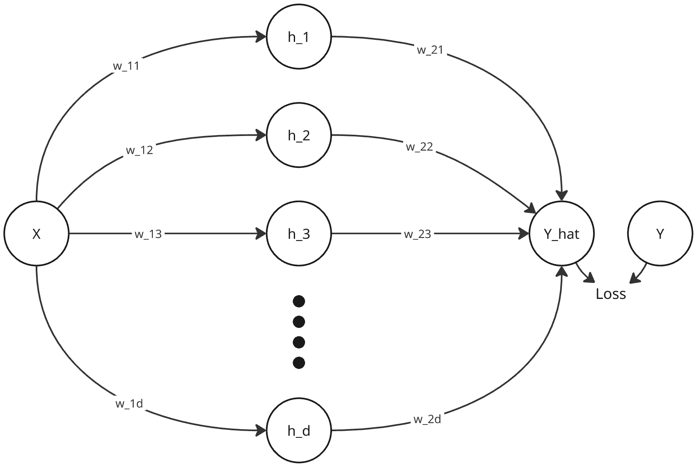

In the image, we can see that there is one node in the input layer, one in output and d in hidden. Suppose the shown values of parameters (w_11, w_12, ... , w_21, w_22, etc) are corresponding to a lower minima, meaning partial derivative of error wrt each of them is 0. 

There are many more possible arrangements of the parameters, keeping the input exact same, which will lead us to the same output, and the partial derivative of error wrt each parameter will be 0.

To get one such arrangement, we can switch w_11 and w_12, and also w_21 and w_22. This will end up leading to h_1 and h_2 also getting swapped. And as we can see, the output will be the same and partial derivates will be the same. We have just switched the values of some parameters and we have landed in a similar landscape in the high-dimensional space, which is also a local minima just like the previous one. 

Any possible arrangement of parameters this way leads us to local minimas similarly. And since there are d nodes in the hidden layer, there are d! of them (atleast because with larger input size, there will be more rearrangements).