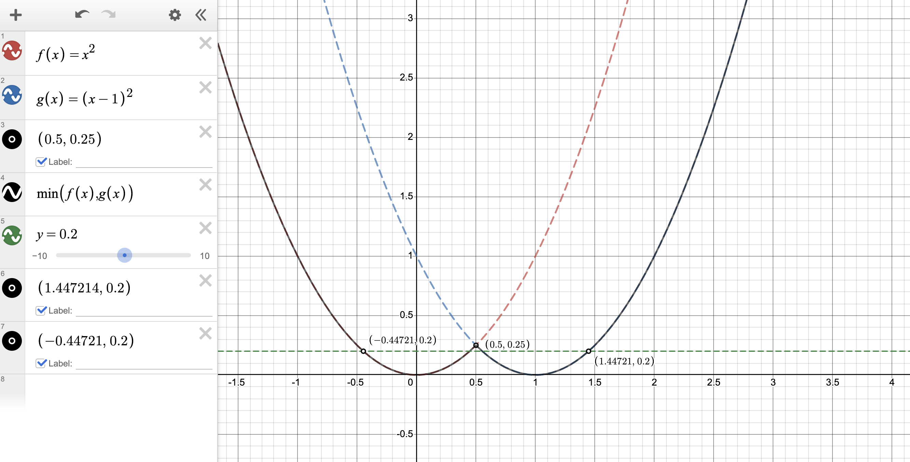

For any x and y, we have to prove the following, where $h(x)$ is the function denoting $max(f,g)$

$h\left(\lambda x\ +\ \left(1-\lambda\right)y\right)<\lambda h\left(x\right)+\left(1-\lambda\right)h\left(y\right)$

Lets imagine $\lambda$ having some value between 0 and 1. For input $\lambda x\ +\ \left(1-\lambda\right)y$, in $h$, the mapping would be either from $f$ or $g$. Now, at the extremes ($x$ and $y$), the value can also come from either f or g, whichever is bigger. If the extremes both have same function's value as the center point ($\lambda x\ +\ \left(1-\lambda\right)y$), then the inequality holds because both $f$ and $g$ are given to be convex. If the edges don't have the same function's value as the center point, that means its a value more than the same function's value at that extreme point, which means that $\lambda h\left(x\right)+\left(1-\lambda\right)h\left(y\right)$ will also be higher than would have been if it was just the same function's values at the extremes. Hence, in any case, the inequality holds, and the max function is convex.

The min case, we can prove to be non-convex with just an example. As shown in below image. For $f\left(x\right)=x^{2}$ and $g\left(x\right)=\left(x-1\right)^{2}$, both these functions as convex, but their minimum is not convex, as demonstrated by the line $y=0.2$, at $\lambda = 0.5$.

