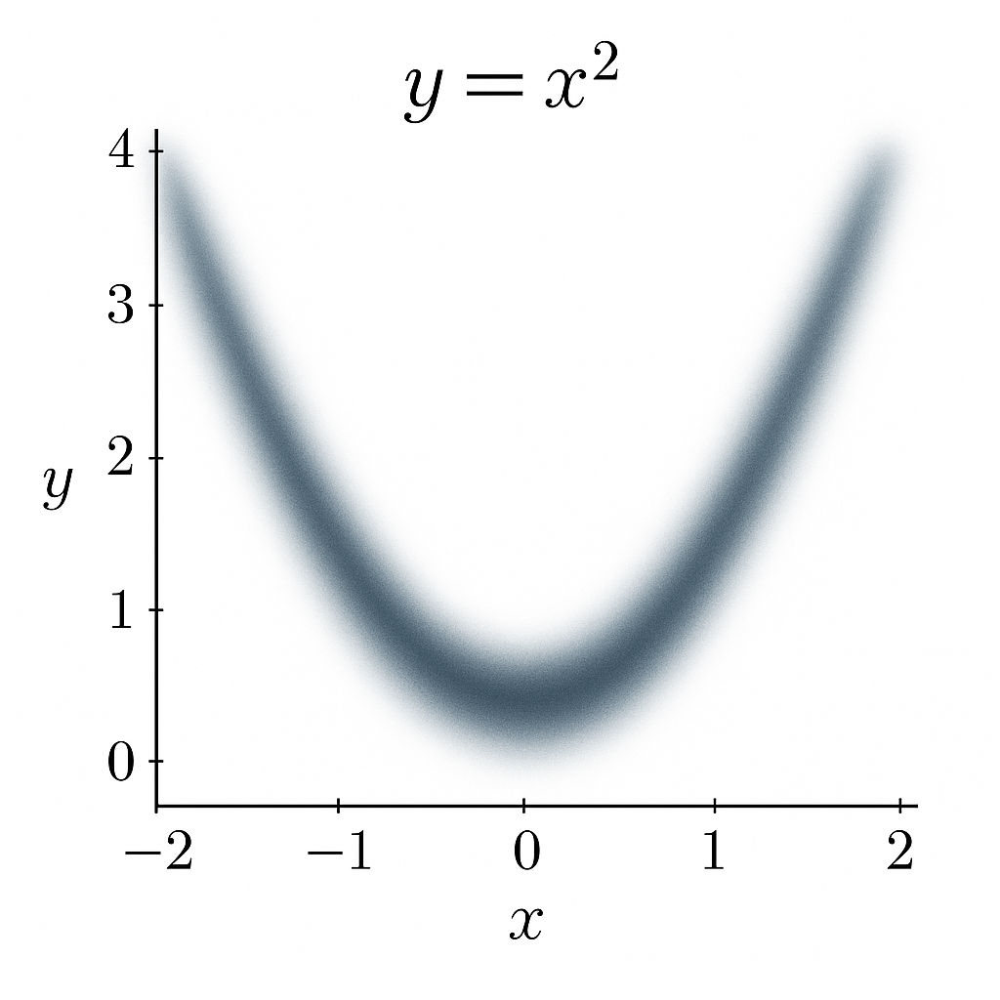

- We deal with one coordinate. The other coordinate can be dealt with in a similar way.
So, if we talk about the first coordinate, x1, on one hand we have the function $f\left(x_{1}\right)=x_{1}^{2}$, whose gradient is $f'\left(x_{1}\right)=2x_{1}$, with noise added version looking like $f'\left(x_{1}\right)=2x_{1}+N\left(u,s\right)$. One can see this as a function looking not like a line but a blurry curve. Below is an example of the same but for the function $f(x) = x^2$

On the other hand, we have a function $f\left(x_{1},w_{1}\right)=\left(x_{1}-w_{1}\right)^{2}=x_{1}^{2}+w_{1}^{2}-2x_{1}w_{1}$, where $x_1$ is the noise entity. If we take the derivative of this function at any point (since our independent variable here is $w_1$, we take derivative wrt $w_1$), it looks like: $f'\left(x_{1},w_{1}\right)=2w_{1}-2x_{1}$. Now note here that $2w_1$ is the derivate if there was no noise added, whereas $-2x_1$ is the added noise in the gradient function. Since $x_1$ is from a normal distribution, $-2x_1$ is also a normal distribution (with quadruple variance). One can imagine the resultant gradient function also as not a line but a blurry curve. And this would look similar to the blurry curve obtained in the first part, hence showing that atleast for such quadratic polynomial functions, adding normal noise to parameters is equivalent to adding normal noise to gradient.

