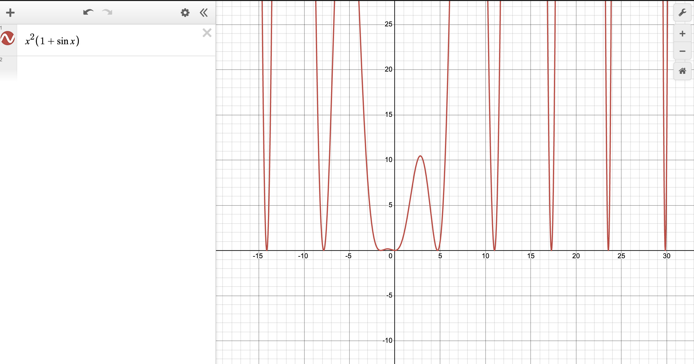
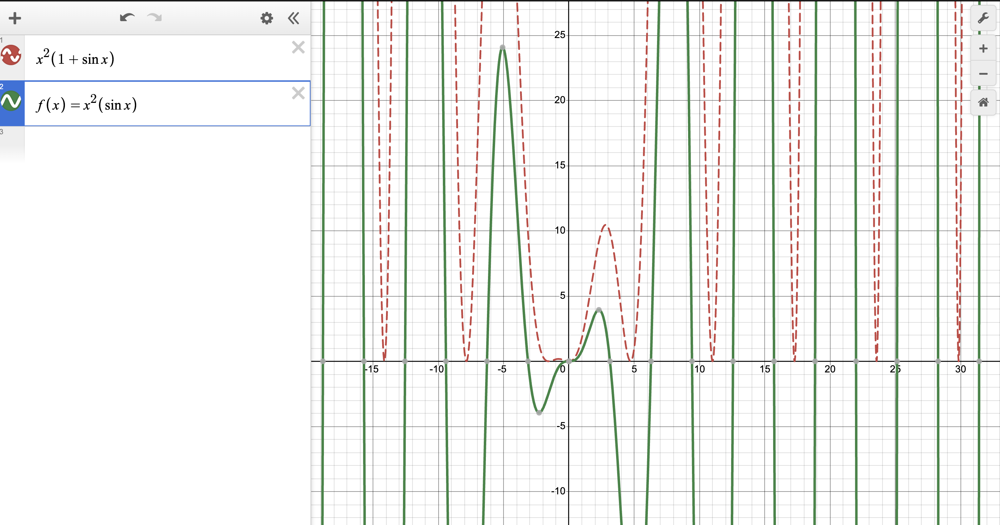

- The function has infinitely many local minima.

Here, just looking at the function, one can see that the minimum value the function can take is 0, because of the fact that both terms cannot be negative. Hence, all local minima are at same minimization. However, if one can modify the function in such a way that both terms are not negative, then, one strategy to find the global minimum (within a range of x values) would be to evaluate all the local minima in that range. One such variation would be: $f\left(x\right)=x^{2}\left(\sin x\right)$.

